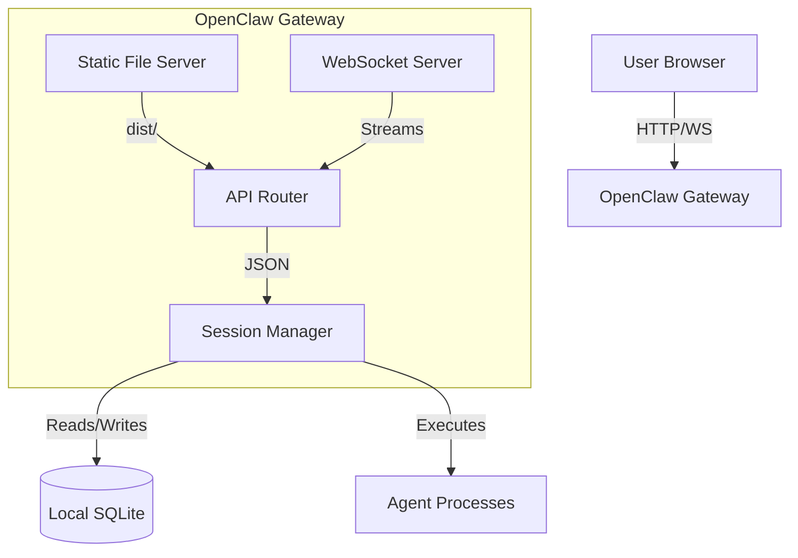

# ARCH.md - Helicarrier "Hologram" (Integrated Web UI)

## Context
Transition from the deprecated Next.js standalone server to an integrated, local-first dashboard served by the OpenClaw Gateway.

## System Design
The "Hologram" is a static-exported React Single Page Application (SPA) bundled with the OpenClaw core. It is served by the existing Gateway daemon (`openclaw gateway start`) on a dedicated local port.

### Architecture
- **UI (The Hologram)**: React/Vite/Tailwind. Bundled as a set of static HTML/JS/CSS files in `dist/`.
- **Server (The Projector)**: A thin Koa or Express router added to the OpenClaw Gateway. It serves the `dist/` directory and exposes a set of `/api/v1/dashboard/*` endpoints.
- **Data (The Repository)**: Directly reads from the local `.openclaw/db/*.sqlite` files and the Gateway's internal session manager.

## Data Flow
1.  **Request**: User runs `openclaw dashboard`.
2.  **Server Start**: The CLI ensures the Gateway is running and opens the browser to `http://localhost:4000`.
3.  **Bootstrap**: The UI fetches the current active sessions via `/api/v1/sessions`.
4.  **Live Updates**: The UI establishes a WebSocket connection to the Gateway for real-time log events (`subagent:started`, `tool:call`, `session:steer`).

## API Contracts
- `GET /api/v1/dashboard/sessions`: Returns a JSON list of all active sessions and their status.
- `POST /api/v1/dashboard/steer`: Accepts a session ID and a steering message to send to an agent.
- `WS /api/v1/dashboard/stream`: Real-time stream of all Gateway log events.

## Security Model
- **Localhost Only**: The dashboard server is bound to `127.0.0.1` by default.
- **No Remote Auth (Phase 1)**: Since it is local-only, no authentication is required. 
- **Filesystem Isolation**: The server only serves files from its own `dist/` and only reads from the `.openclaw` workspace.

## Tradeoffs
- **Bundling Overhead**: Slightly increases the initial `npm install` size due to UI assets.
- **Port Conflict**: May need a fallback port mechanism if `4000` is taken.

## Mermaid

