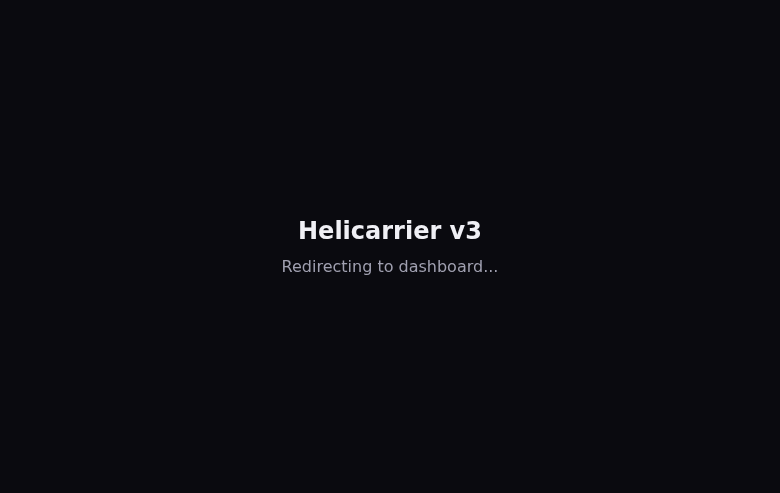
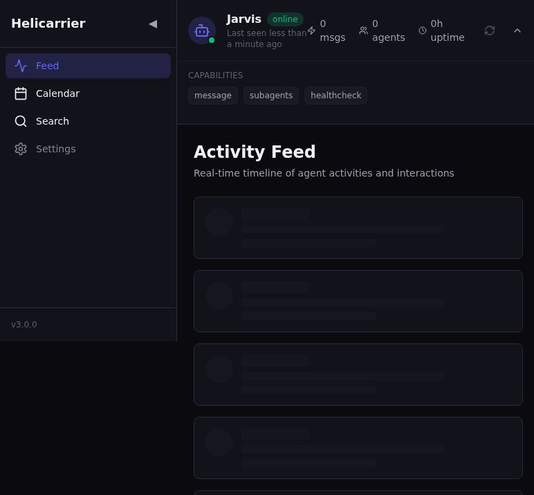
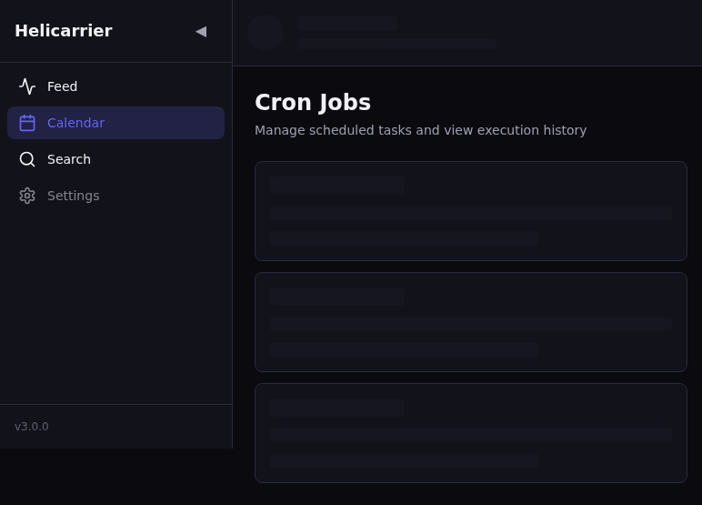
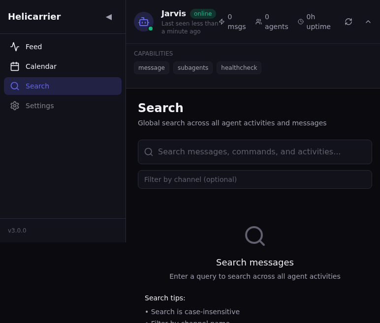

# Helicarrier v3

**Real-time Mission Control Dashboard for OpenClaw Agent Operations**

## Overview

Helicarrier v3 is a real-time mission control dashboard for monitoring and managing OpenClaw agent operations. It provides a centralized interface for viewing activity feeds, managing cron jobs, searching message history, and monitoring agent status.

**Version:** 3.0.0  
**Status:** ✅ Production Ready  
**Build Date:** 2026-02-27

## Tech Stack

| Technology | Version | Purpose |
|------------|---------|---------|
| **Framework** | Next.js 14.2.21 | App Router, Server Components, API Routes |
| **Language** | TypeScript 5.7.2 | Type safety and developer experience |
| **Styling** | Tailwind CSS 3.4.15 | Utility-first CSS framework |
| **State Management** | Zustand 5.0.2 | Client-side state management |
| **Server State** | SWR 2.3.0 | Data fetching with caching and revalidation |
| **Icons** | Lucide React 0.468.0 | Consistent icon library |
| **Date Handling** | date-fns 4.1.0 | Lightweight date formatting |
| **React** | 18.3.1 | UI library |

## 📁 Project Structure

```
helicarrier/
├── src/                 # Application source code
│   ├── app/            # Next.js App Router pages & API routes
│   ├── components/     # React components
│   ├── lib/           # Utilities, hooks, types
│   └── styles/        # Global styles
├── docs/              # Project documentation
│   ├── agent-workflow/  # Agent pipeline docs (REQ, ARCH, TASKS, QA, etc.)
│   ├── screenshots/     # UI screenshots
│   ├── DECISIONS.md     # Architecture decisions
│   └── RUN_STATE.md     # Pipeline state
├── REPORTS/           # Test reports, final reports
├── public/            # Static assets
├── __mocks__/         # Jest mocks
├── .env.example       # Environment template
├── .env.local         # Local environment (gitignored)
├── package.json       # Dependencies
├── next.config.mjs    # Next.js config
├── tailwind.config.js # Tailwind config
├── tsconfig.json      # TypeScript config
├── jest.config.js     # Jest config
└── jest.setup.js      # Jest setup
```

**Note:** Agent workflow documents (REQ.md, ARCH.md, TASKS.md, QA.md, CLAUDE.md, GEMINI.md, ISSUES.md) are in `docs/agent-workflow/` to keep the root clean.

---

## Quick Start

### Prerequisites

- Node.js 18+ 
- npm or yarn
- OpenClaw Gateway access (URL + token)

### Installation

```bash
# Clone the repository
git clone https://github.com/humac/helicarrier.git
cd helicarrier

# Install dependencies
npm install

# Copy environment example and configure
cp .env.example .env.local

# Edit .env.local with your Gateway credentials
# GATEWAY_URL=http://localhost:8080
# GATEWAY_TOKEN=your-secret-token-here
```

### Development

```bash
# Start development server
npm run dev

# Open http://localhost:3000 in your browser
```

### Build

```bash
# Create production build
npm run build

# Verify build artifacts in .next/
```

### Run Production

```bash
# Start production server
npm run start
```

### Type Check

```bash
# Run TypeScript type checking
npm run type-check
```

### Lint

```bash
# Run ESLint
npm run lint
```

## Project Structure

```
projects/helicarrier/
├── src/
│   ├── app/                    # Next.js App Router
│   │   ├── api/                # API Routes (server-side only)
│   │   │   ├── feed/           # Feed data endpoint
│   │   │   ├── calendar/       # Calendar/cron jobs endpoint
│   │   │   ├── search/         # Search endpoint
│   │   │   └── sessions/       # Sessions endpoint
│   │   ├── feed/               # Activity Feed page
│   │   ├── calendar/           # Calendar/Cron page
│   │   ├── search/             # Global Search page
│   │   ├── layout.tsx          # Root layout with providers
│   │   └── page.tsx            # Home (redirects to /feed)
│   ├── components/
│   │   ├── ui/                 # Base UI primitives
│   │   ├── layout/             # Layout components (Nav, AgentBanner)
│   │   └── features/           # Feature-specific components
│   ├── lib/
│   │   ├── openclaw.ts         # Gateway client (server-side)
│   │   ├── types.ts            # TypeScript interfaces
│   │   ├── utils.ts            # Utility functions
│   │   └── providers.tsx       # React providers (SWR, etc.)
│   ├── hooks/                  # Custom React hooks
│   └── store/                  # Zustand stores
├── .env.local                  # Environment variables (gitignored)
├── .env.example                # Example env file
├── ARCH.md                     # System architecture documentation
├── REQ.md                      # Requirements specification
├── TASKS.md                    # Task breakdown and status
├── QA.md                       # QA checklist and results
├── package.json
├── tsconfig.json
├── tailwind.config.ts
└── next.config.mjs
```

## Deployment Notes

### Environment Variables

| Variable | Required | Description |
|----------|----------|-------------|
| `GATEWAY_URL` | Yes | OpenClaw Gateway API URL |
| `GATEWAY_TOKEN` | Yes | Bearer token for Gateway authentication |

### Security Considerations

- **NEVER** expose `GATEWAY_TOKEN` to the client-side
- Token is only used in server-side API routes
- All Gateway communication happens through Next.js API route proxy
- Environment variables are validated on startup

### Deployment Options

1. **Standalone Mode** (Recommended)
   ```bash
   npm run build
   # Output: .next/standalone/
   # Deploy the standalone folder to your server
   ```

2. **Docker Deployment**
   - Use Next.js standalone output
   - Configure environment variables in container
   - Expose port 3000

3. **Vercel/Netlify**
   - Push to Git repository
   - Configure environment variables in platform
   - Automatic builds on push

### Production Checklist

- [ ] Set `GATEWAY_URL` to production Gateway endpoint
- [ ] Rotate `GATEWAY_TOKEN` for production
- [ ] Enable HTTPS
- [ ] Configure CORS if needed
- [ ] Set up monitoring and logging
- [ ] Test all API endpoints
- [ ] Verify error handling

## 📸 Screenshots

### Home Page


### Activity Feed


### Cron Calendar


### Global Search


---

## Features

### Activity Feed (`/feed`)
- Real-time message feed from OpenClaw Gateway
- Filter by agent, tool, date range
- Infinite scroll with pagination
- Auto-refresh every 5 seconds
- Expandable message details

### Calendar (`/calendar`)
- View scheduled cron jobs
- Enable/disable jobs with one click
- Manual job trigger
- Job execution history
- Monthly calendar view

### Search (`/search`)
- Global search across all messages
- Filter by channel, agent, date, type
- Search result highlighting
- Export results (JSON/CSV)
- Conversation grouping

### Agent Status Banner
- Real-time agent status (online/busy/offline)
- Statistics: messages sent, active sub-agents, uptime
- Capability badges
- Auto-refresh

## API Endpoints

| Endpoint | Method | Description |
|----------|--------|-------------|
| `/api/feed` | GET | Fetch activity feed messages |
| `/api/calendar` | GET | Fetch cron jobs |
| `/api/calendar/:id/toggle` | POST | Enable/disable job |
| `/api/calendar/:id/trigger` | POST | Manual job trigger |
| `/api/search` | GET | Search messages |
| `/api/sessions` | GET | List active sessions |
| `/api/history` | GET | Fetch session history |

## 📸 Screenshots

### Home Page


### Activity Feed


### Cron Calendar


### Global Search


## Troubleshooting

### Build Fails

```bash
# Clear cache and rebuild
rm -rf .next node_modules
npm install
npm run build
```

### Gateway Connection Errors

- Verify `GATEWAY_URL` is correct and accessible
- Check `GATEWAY_TOKEN` is valid
- Ensure Gateway service is running
- Check network/firewall settings

### TypeScript Errors

```bash
# Run type check to see detailed errors
npm run type-check
```

## Documentation

| Document | Purpose |
|----------|---------|
| [`ARCH.md`](./ARCH.md) | System architecture and design decisions |
| [`REQ.md`](./REQ.md) | Requirements specification |
| [`TASKS.md`](./TASKS.md) | Task breakdown and implementation status |
| [`QA.md`](./QA.md) | QA checklist and test results |
| [`CLAUDE.md`](./CLAUDE.md) | AI assistant context (Claude/general) |
| [`GEMINI.md`](./GEMINI.md) | AI assistant context (Gemini-specific) |
| [`DECISIONS.md`](./DECISIONS.md) | Architectural decisions log |
| [`ISSUES.md`](./ISSUES.md) | Issues encountered and resolutions |
| [`REPORTS/final-report.md`](./REPORTS/final-report.md) | Final project report and post-mortem |

## Contributing

1. Follow the architecture in `ARCH.md`
2. Update `TASKS.md` with progress
3. Run QA checks before merging
4. Document decisions in `DECISIONS.md`

## License

Internal project - OpenClaw Workspace

---

## Project Status

**Status:** ✅ **COMPLETE** (2026-02-27)

All deliverables have been implemented, tested, and documented. The project is production-ready.

### Final Feature List

- ✅ Activity Feed (`/feed`) - Real-time timeline with filters and auto-refresh
- ✅ Calendar (`/calendar`) - Cron job management with enable/disable and manual trigger
- ✅ Search (`/search`) - Global message search with filters and export
- ✅ Agent Status Banner - Real-time status with statistics and capabilities
- ✅ Responsive Navigation - Desktop sidebar + mobile bottom bar
- ✅ API Routes - 7 endpoints for data fetching and actions
- ✅ Error Handling - Graceful degradation with fallback UI states
- ✅ Type Safety - Full TypeScript coverage
- ✅ Unit Tests - 9/9 tests passing
- ✅ Browser QA - All pages verified with screenshots

### Known Limitations

| Limitation | Impact | Workaround |
|------------|--------|------------|
| Gateway `/tools/invoke` 500 error | `/api/history`, `/api/cron` fail | App handles gracefully with error states |
| Dark theme only | No light mode toggle | Future enhancement (Phase 6) |
| No WebSocket | 5s polling interval | Future enhancement (Phase 6) |

### Deployment Instructions

1. **Set environment variables:**
   ```bash
   GATEWAY_URL=http://your-gateway:8080
   GATEWAY_TOKEN=your-secret-token
   ```

2. **Build:**
   ```bash
   npm run build
   ```

3. **Deploy:**
   - Standalone: Deploy `.next/standalone/` folder
   - Docker: Use standalone output in container
   - Vercel: Push to Git, configure env vars

4. **Verify:**
   - Open `http://localhost:3000` (or deployed URL)
   - Check all pages render
   - Verify API endpoints respond

---

**Last Updated:** 2026-02-27  
**Maintained By:** @pepper (Analyst)  
**Project:** Helicarrier v3 ✅ COMPLETE
